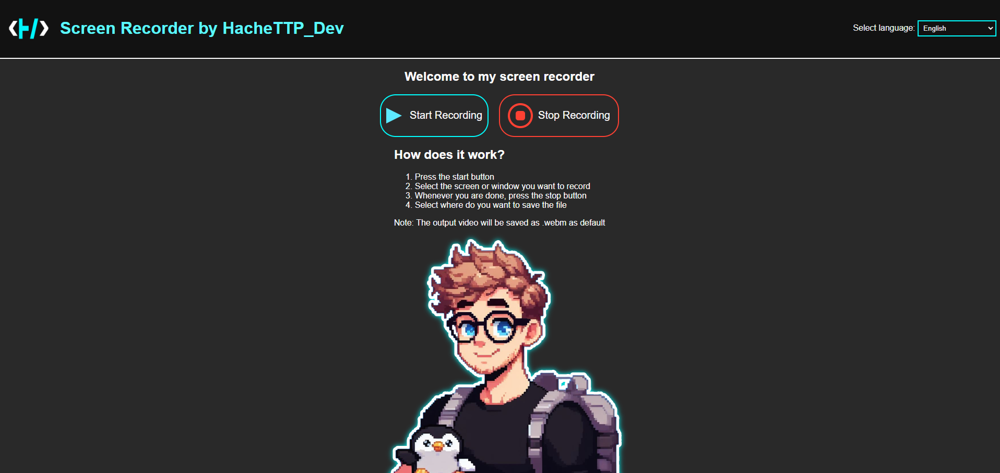

# Screen Recorder by HacheTTP_Dev



## Descripción

Este es un proyecto de grabador de pantalla que te permite capturar la pantalla de tu ordenador con audio. La grabación se guarda automáticamente en formato `.webm`. La interfaz soporta múltiples idiomas, permitiendo una experiencia más inclusiva.

## Características

- Graba la pantalla con audio
- Guarda la grabación en formato `.webm`
- Soporte para múltiples idiomas (Español, Inglés, Francés, Alemán, Ruso y Japonés)

## Uso

### Instalación

1. Clona este repositorio en tu máquina local:
    ```bash
    git clone https://github.com/tu_usuario/screen-recorder.git
    ```
2. Navega hasta el directorio del proyecto:
    ```bash
    cd screen-recorder
    ```
3. Abre `index.html` en tu navegador web preferido.

### Instrucciones

1. Selecciona el idioma en el menú desplegable en la parte superior.
2. Haz clic en **Iniciar grabación** para comenzar a grabar.
3. Selecciona la pantalla o ventana que deseas grabar.
4. Cuando hayas terminado, haz clic en **Detener grabación**.
5. Elige dónde deseas guardar el archivo `.webm`.

### Mención

Agradecer a <a href="https://github.com/midudev"> MiduDev </a>
Ya que esta idea la he sacado de un video que ha subido a su canal de Youtube.
Llevando el concepto a mi terreno y mejorándolo aún más.
